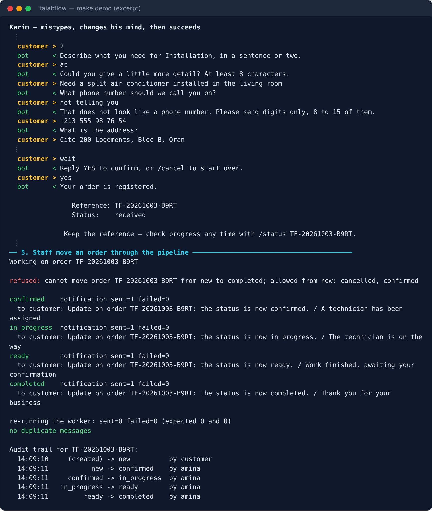
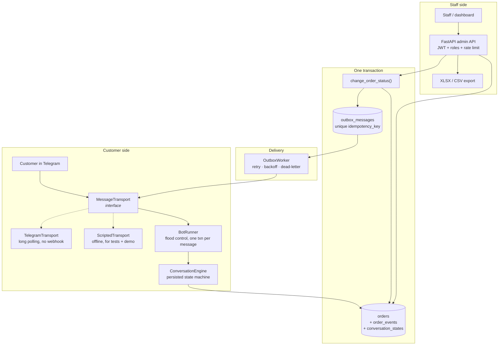

# talabflow · طَلَبْ‑فلو

**Turn chat conversations into tracked orders — with a reference number, a status pipeline, an
audit trail, a staff API and a spreadsheet export. Runs on your own server. Demoable with no
bot token and no network.**

> Arabic *طَلَب* means "an order" or "a request". `talabflow` is the flow of a request from a
> chat message to a closed record.

**[اقرأ بالعربية](README.ar.md)**

[](https://github.com/pgun879-alt/talabflow/actions/workflows/ci.yml)
[](https://www.python.org/)
[](#testing)
[](#testing)
[](LICENSE)



<sub>Real output of `make demo`, excerpted (`⋮` marks omitted lines). No bot token, no network.</sub>

---

## The problem this solves

A repair shop, a salon, a delivery service or a tutoring centre takes its orders through
Telegram. It works, right up until it doesn't:

- **No reference number.** "My washing machine" is not an identifier, and neither is a phone
  number that three people share.
- **No status.** Answering "is it ready?" means scrolling chat history.
- **No list of what's open.** Nobody can say how many jobs are outstanding without reading
  every conversation.
- **No export.** Accounting runs on spreadsheets, and chat is not one.
- **No reliable notification.** Telling every customer about every status change by hand is
  the first thing that gets dropped on a busy day.

Chat is a wonderful front door and a terrible database. `talabflow` keeps the front door and
puts a real system behind it.

## What makes it different from a tutorial Telegram bot

| | Typical tutorial bot | `talabflow` |
|---|---|---|
| Testable without a bot token | No — you message it by hand | **Yes** — messaging is an interface with an offline transport; 324 tests, zero network calls |
| Conversation state | A dict in memory, lost on restart | Persisted per customer; a half-finished order survives a restart |
| Unscripted input | Breaks on anything unexpected | Explicit state machine; every invalid value re-prompts |
| Status changes | `UPDATE orders SET status=...` | Guarded transitions + an immutable audit event per change |
| Customer notifications | `send_message()` inline, lost on crash | **Transactional outbox** written in the same transaction, delivered by a worker with retry, backoff and dead-lettering |
| Duplicate messages | Likely | Deduplicated by a unique key derived from the event id |
| Staff access | The developer's own Telegram account | JWT auth, `admin`/`staff` roles, rate limiting |
| Hosting | Needs a public webhook URL | Long polling — no public IP, no tunnel, no TLS certificate, no bill |

## Architecture



### The three decisions that matter

**1. Messaging is an interface, not a library call.** `MessageTransport` has two
implementations: the real Telegram Bot API, and an in-memory scripted transport. The entire
conversation — every branch, every validation failure, every order created — is driven by tests
and by `make demo` with **no token and no network**. The same code talks to real Telegram when
a token is configured. A tutorial bot calls the API from inside its message handler, which means
its behaviour can only be checked by messaging it by hand.

**2. Notifications are rows, not calls.** When a status changes, the customer notification is
written to `outbox_messages` **in the same transaction** as the status change. A crash between
"status changed" and "customer told" is therefore impossible. A separate worker delivers from
that durable state, with exponential backoff and dead-lettering. `idempotency_key` is unique and
derived from the audit event's id, so replaying a change cannot produce a second message.

**3. Conversation state is persisted, per customer.** Not a dict in memory. Restart the bot
mid-order and the customer continues from where they were.

## Quickstart

```bash
git clone https://github.com/pgun879-alt/talabflow.git && cd talabflow
make setup
make demo
```

`make demo` needs **no bot token and no network**. It migrates a fresh database, creates staff
accounts, runs two scripted customer conversations (one clean, one full of mistakes), walks an
order through the pipeline, shows the notifications the customer receives, proves the worker
does not send them twice, prints the audit trail, and exports a spreadsheet.

Without `make`:

```bash
python3 -m venv .venv && ./.venv/bin/pip install -e '.[dev]' && ./scripts/demo.sh
```

## Connecting real Telegram

The only step that needs anything external. `@BotFather` issues tokens for free.

1. Message [@BotFather](https://t.me/BotFather) on Telegram, send `/newbot`, follow the prompts.
2. Put the token in `.env`:

```bash
TALABFLOW_TRANSPORT=telegram
TALABFLOW_TELEGRAM_BOT_TOKEN=123456789:your-token-from-botfather
```

3. Run the two processes:

```bash
./.venv/bin/python -m talabflow.cli run-bot
```

```bash
./.venv/bin/python -m talabflow.cli run-worker
```

Then message your bot `/start`. No webhook, no public IP, no TLS certificate — it uses long
polling outbound only.

## Usage

### CLI

```bash
./.venv/bin/alembic upgrade head                      # apply migrations
./.venv/bin/python -m talabflow.cli create-staff amina --admin   # prompts for the password
./.venv/bin/python -m talabflow.cli list-orders --status new
./.venv/bin/python -m talabflow.cli set-status TF-20260928-K7M2 confirmed --note "Tech assigned"
./.venv/bin/python -m talabflow.cli export orders.xlsx
./.venv/bin/python -m talabflow.cli config             # effective settings, secrets redacted
./.venv/bin/python -m talabflow.cli serve              # the admin API
```

### Admin API

```bash
./.venv/bin/python -m talabflow.cli serve
```

`http://127.0.0.1:8000/docs` is the generated OpenAPI console.

| Method | Route | Role | Purpose |
|---|---|---|---|
| `POST` | `/v1/auth/token` | — | Exchange username + password for a JWT |
| `GET` | `/v1/orders` | staff | List orders; filter by `status`, free-text `search`, paginate |
| `GET` | `/v1/orders/{reference}` | staff | Full order, audit trail, and allowed next statuses |
| `POST` | `/v1/orders/{reference}/status` | staff | Change status; queues the customer notification |
| `GET` | `/v1/orders-export?format=xlsx\|csv` | staff | Download a spreadsheet |
| `GET` | `/v1/stats` | staff | Counts per status |
| `GET` `POST` | `/v1/staff` | **admin** | List / create staff accounts |
| `GET` | `/healthz` · `/readyz` | — | Liveness · readiness (checks the database) |

```bash
TOKEN=$(curl -s -X POST http://127.0.0.1:8000/v1/auth/token \
  -H 'Content-Type: application/json' \
  -d '{"username":"amina","password":"your-password"}' | python3 -c 'import json,sys;print(json.load(sys.stdin)["access_token"])')

curl -s -H "Authorization: Bearer $TOKEN" 'http://127.0.0.1:8000/v1/orders?status=new'
```

A status change response includes what can happen next, so a client never has to guess:

```jsonc
{
  "reference": "TF-20260928-K7M2",
  "status": "confirmed",
  "allowed_next_statuses": ["cancelled", "in_progress"],
  "events": [
    { "from_status": null, "to_status": "new", "actor": "customer", "note": "order created" },
    { "from_status": "new", "to_status": "confirmed", "actor": "amina", "note": "Tech assigned" }
  ]
}
```

An invalid change returns **409 Conflict** (the request is well-formed, it conflicts with
current state) and names what is permitted:

```
cannot move order TF-20260928-K7M2 from new to completed; allowed from new: cancelled, confirmed
```

### Docker

```bash
cp .env.example .env    # then edit it — a real JWT secret is required
docker compose up --build
```

Starts four services: `migrate` (runs once), `api`, `bot`, `worker`. The API is published on
`127.0.0.1:8000` only — a staff API should not be network-reachable until someone deliberately
puts a TLS-terminating proxy in front of it.

## Configuration

Environment variables prefixed `TALABFLOW_`, read from the environment or a local `.env`. See
[`.env.example`](.env.example) for the annotated list. Defaults run offline.

Configuration is validated at startup and **refuses to run in an unsafe state**:

| Misconfiguration | Result |
|---|---|
| `TRANSPORT=telegram` with no bot token | Startup fails, pointing at the offline transport |
| `ENVIRONMENT=production` with the `.env.example` placeholder secret | Startup fails — shipping the example verbatim is the likeliest deployment mistake |
| `ENVIRONMENT=production` with a secret under 32 characters | Startup fails |
| `ENVIRONMENT=production` with `CORS_ALLOW_ORIGINS=*` | Startup fails |
| Empty or duplicated `SERVICE_TYPES` | Startup fails — duplicates would make two menu numbers mean the same thing |

Development stays permissive, so none of this makes local work painful.

## Testing

```bash
make check      # ruff format --check + ruff check + mypy + pytest
make test
```

Verified on Python 3.13.9, Linux, by running these commands after the most recent change:

```
324 passed                                       # pytest
Success: no issues found in 19 source files      # mypy
All checks passed!                               # ruff check
41 files already formatted                       # ruff format --check
```

CI (`.github/workflows/ci.yml`) runs the same four checks in a clean container on every push, plus
an Alembic `upgrade head` + `check` to prove migrations match the models, and a repository-hygiene
scan that fails the build if a database, a virtual environment or a credential-shaped literal is
ever committed.

The suite runs **fully offline**. The Telegram transport is exercised through an in-process
`httpx` mock transport, so request shape, offset persistence, update parsing and error
classification are genuinely tested — without a token or a network call.

Coverage is concentrated where the risk is: 47 tests on the conversation state machine, 32 on the
repository and outbox write path, 22 on outbox claiming and the duplicate-enqueue savepoint
(`tests/test_outbox_claim.py`), 25 on the Telegram transport, 43 on the API, 31 on security
primitives.

## Security

| Concern | How it is handled |
|---|---|
| Passwords | `hashlib.scrypt` (RFC 7914, memory-hard) with a per-password random salt and the cost parameters stored inside the hash, so they can be raised later without invalidating existing passwords. Compared with `hmac.compare_digest`. |
| Tokens | Short-lived HS256 JWTs. The allowed algorithm is passed explicitly as a single-item list — accepting the token's own `alg` header is the classic JWT forgery (`alg: none`, or HS256 verified against an RSA public key). `exp`, `iat` and `sub` are required. |
| Login enumeration | "No such user", "wrong password" and "deactivated" return one identical message, and a missing user still runs a hash comparison so it does not return measurably faster. |
| Authorisation | Role checks are FastAPI dependencies, so forgetting one makes a route *unreachable* rather than public. |
| Order privacy | The customer-facing `/status` lookup is scoped to the requesting customer. Without that, anyone who guessed or overheard a reference could read another customer's phone number and address. Tested. |
| Reference guessing | References use `secrets`, not `random`. A predictable reference would let someone enumerate orders. |
| SQL injection | SQLAlchemy ORM throughout; search uses a bound `LIKE` parameter, with a test asserting that `'; DROP TABLE orders; --` matches nothing and the table survives. |
| Spreadsheet formula injection | A customer can type `=HYPERLINK("http://evil","click")` into a chat field. Excel and LibreOffice evaluate that when staff open the export — free-text field to code execution on the buyer's machine. Leading formula triggers are prefixed with an apostrophe. Tested for both CSV and XLSX. |
| Markup injection | Telegram messages are sent with **no `parse_mode`**, because confirmations echo customer text back. |
| Flood control | Per-customer sliding window on inbound messages; per-user on the API, returning 429 with `Retry-After`. |
| Secrets | Never committed. `.env`, `data/`, `*.sqlite3` are git-ignored; `.env.example` holds placeholders. Secret fields use `repr=False`. The Alembic config reads the database URL from the environment so a connection string with a password is never in a committed file. |
| Log hygiene | Structured JSON logs carry references, ids, counts and timings — **never** a phone number, an address, or a message body. |
| Shell execution | None. No customer or staff input ever reaches a shell. |
| Container | Non-root user (uid 10001), two-stage build, `.dockerignore` excludes `.env` and `data/`. |
| Default bind | `127.0.0.1` outside Docker. |

## Delivery guarantees, stated precisely

This is **at-least-once delivery**. It is **not** exactly-once, and it cannot be: Telegram's
`sendMessage` accepts no client-supplied idempotency key, so no client can make a redelivery a
no-op on the provider's side. Any tool claiming exactly-once over Telegram is wrong.

What the design does guarantee:

- the notification row is written in the **same transaction** as the status change, so neither can
  exist without the other;
- `idempotency_key` is unique and derived from the audit event id, so one logical change can never
  produce two rows;
- a worker **claims** a row — committing `status = processing` with a lease, including the worker
  id and an expiry — **before** making any outbound call, so two workers never hold the same row;
- if the worker holding a row dies, its lease expires and the row becomes claimable again, so a
  crash does not strand a message;
- rows are marked `sent` immediately after the transport confirms, committed **per message** rather
  than per batch.

**The window that remains:** if a worker crashes *after* the provider accepted a message but
*before* the `sent` commit, the lease eventually expires and the message is delivered a second
time. That is inherent to at-least-once over a provider without idempotency keys.

### Concurrency

The claim is a single guarded `UPDATE`:

```sql
UPDATE outbox_messages
   SET status='processing', claimed_by=?, lease_expires_at=?
 WHERE id IN (SELECT id ... WHERE <claimable> ORDER BY ... LIMIT ?)
   AND <claimable>          -- repeated deliberately
```

The repeated predicate is load-bearing. On **PostgreSQL** two statements can both pick the same id
in their subqueries; the second blocks on the row lock, and when it proceeds PostgreSQL
re-evaluates the outer `WHERE` against the newly committed row. Without the repeated predicate the
row still matches by id and the second worker would overwrite the first worker's lease. On
**SQLite** writes are serialised and a single `UPDATE` is atomic, so the second worker's subquery
simply sees the claimed rows and skips them.

**What is tested:** two workers in two threads against one SQLite file, asserting every
notification is delivered exactly once and each message is attempted exactly once
(`tests/test_outbox_claim.py`). Reverting the claim to a plain `SELECT` makes that test fail with
duplicate deliveries, which is how the test was validated.

**PostgreSQL:** the same test, with two real threads, also runs against PostgreSQL 16 in CI (the
`postgres` job) and passes. What is still not tested is PostgreSQL under sustained production
load, so treat multi-worker operation there as test-verified, not field-proven.

`TALABFLOW_OUTBOX_LEASE_SECONDS` must exceed `TALABFLOW_HTTP_TIMEOUT_SECONDS`, or a slow send could
outlive its own lease and be reclaimed mid-flight — the one way this design could duplicate a
message. Startup refuses that combination rather than leaving it as a footgun.

## Limitations

1. **WhatsApp is not supported.** The Cloud API requires a verified business account and a
   Meta app review. `MessageTransport` is the seam a WhatsApp implementation would slot into;
   nothing above it would change. Not claimed as working, because it isn't written.
2. **Single business per deployment.** No multi-tenancy. Two shops need two deployments.
3. **SQLite is the default; PostgreSQL is verified in CI only.** The demo and the Docker Compose
   file run on SQLite, and `PRAGMA busy_timeout` handles the bot and worker writing concurrently.
   A separate CI job runs the migrations (up, `alembic check`, down) and the test suite against
   PostgreSQL 16 with no code change: install the driver with `pip install -e '.[postgres]'` and
   point `TALABFLOW_DATABASE_URL` at `postgresql+psycopg://...`. **No PostgreSQL deployment has
   been run** — the Compose service for it is still an unverified sketch — so this is "the tests
   pass on it", not "it has been operated on it".
4. **Rate limits and flood control are per-process.** They reset on restart and are not shared
   between workers. Honest for a single-server deployment; a horizontally scaled one needs Redis.
5. **Language is per-deployment, not per-customer.** `TALABFLOW_DEFAULT_LANGUAGE` picks English
   or Arabic for every customer. Per-customer detection is in the roadmap.
6. **No web dashboard.** The API is complete and documented; there is no UI on top of it. Staff
   use the CLI, the OpenAPI console, or a client someone builds.
7. **No payments, no scheduling, no inventory.** Intake and tracking only.
8. **Multi-worker delivery is verified by tests, not in production.** Workers lease each message
   before sending, and two concurrent workers are tested not to double-send on both SQLite and
   PostgreSQL 16 (CI). On PostgreSQL the claim does not use `SKIP LOCKED`, so under heavy
   contention workers do redundant work — correct, but not optimal.
9. **No message media.** Photos, voice notes and location pins are ignored; text only.

## Troubleshooting

**`TALABFLOW_TRANSPORT=telegram requires TALABFLOW_TELEGRAM_BOT_TOKEN`** — working as intended.
Either set the token or use `scripted`.

**`TALABFLOW_JWT_SECRET is still the placeholder`** — you set `ENVIRONMENT=production` without
generating a secret. Run:

```bash
python3 -c "import secrets; print(secrets.token_urlsafe(48))"
```

**The bot starts but does not answer** — check `run-bot` is running *and* that the token belongs
to the bot you are messaging. Set `TALABFLOW_LOG_LEVEL=DEBUG` to see each poll.

**Customers are not receiving status updates** — the notification is queued by the API, but
delivery is the worker's job. Confirm `run-worker` is running. Inspect the queue with:

```bash
sqlite3 data/talabflow.sqlite3 "SELECT id,status,attempts,last_error FROM outbox_messages WHERE status!='sent';"
```

**An outbox message is `dead`** — either the retry budget was exhausted (`last_error` says why)
or the customer blocked the bot, which is permanent and not retried.

**`409 Conflict` on a status change** — the transition is not allowed from the current status.
The error message lists the permitted targets; `GET /v1/orders/{reference}` also returns
`allowed_next_statuses`.

**Arabic looks like `طلب` in Excel** — you opened the CSV without the BOM. The export
includes one; make sure your tooling is not stripping it, or open the XLSX instead.

**`make setup` fails with "externally-managed-environment"** — install into the virtual
environment. `make setup` does this; do not run `pip install` outside `.venv`.

## Implementation status

Every row was verified by running the code.

| Feature | Status |
|---|---|
| Intake conversation state machine, persisted per customer | ✅ 47 tests |
| Order references (unambiguous alphabet, confusable correction) | ✅ 26 tests |
| Status pipeline with guarded transitions | ✅ Tested, including every refusal |
| Immutable audit trail per change | ✅ Verified in the demo output |
| Transactional outbox + worker with retry/backoff/dead-letter | ✅ 17 tests |
| Notification deduplication per event | ✅ Verified live and in tests |
| Outbox claim + lease, so two workers never send the same message | ✅ 22 tests, including two real threads against one database. **Verified on SQLite and on PostgreSQL 16 in CI.** |
| Crash recovery via lease expiry | ✅ Tested |
| Token revocation: deactivation, deletion and demotion take effect on the next request | ✅ 4 tests |
| Admin API: auth, RBAC, orders, status, stats, staff | ✅ 39 tests + live `curl` run |
| XLSX / CSV export with formula-injection guard | ✅ 16 tests |
| Alembic migrations | ✅ `upgrade`, `downgrade`, re-`upgrade` and `alembic check` all verified, and run in CI |
| CI (format, lint, types, tests, migrations, hygiene) | ✅ Workflow committed and valid. Its real status is the CI badge at the top of this file, which reports whatever GitHub last ran — including "no runs yet" |
| Offline scripted transport | ✅ The default; the whole suite runs on it |
| Telegram transport | ⚠️ Implemented and tested against a mock transport — request shape, offset persistence, parsing, error classification. **Not yet run against the real Bot API**, because that needs a bot token this project does not have. |
| Docker image + compose | ✅ Image builds; `compose up` not exercised end-to-end |
| WhatsApp | ❌ Not implemented (see Limitations) |
| Web dashboard | ❌ Not implemented |
| Multi-tenancy | ❌ Not implemented |

The ⚠️ row is the honest boundary of what has been *executed*. The HTTP contract, offset
handling and permanent-vs-transient error classification are all covered by tests against a mock
transport, but no message has been sent through real Telegram from this code.

## Roadmap

1. Run against a real bot token and record the result (closes the one ⚠️).
2. Per-customer language detection instead of a per-deployment default.
3. Verify the PostgreSQL Compose service end to end (the migrations and test suite already run
   on PostgreSQL in CI), then add `FOR UPDATE SKIP LOCKED` to the claim, which on PostgreSQL is a
   throughput optimisation rather than a correctness fix: the repeated predicate already makes
   the claim safe.
4. A minimal staff web dashboard over the existing API.
5. WhatsApp Cloud API transport behind the existing interface.
6. Scheduled appointments with reminder notifications.
7. Redis-backed rate limiting for multi-worker deployments.

## Project layout

```
src/talabflow/
├── config.py          Settings, validated at startup (production guards)
├── models.py          SQLAlchemy models, status table, UtcDateTime
├── db.py              Engine, session factory, SQLite pragmas
├── repository.py      Data access + the transactional-outbox write path
├── conversation.py    The intake state machine
├── messages.py        Customer-facing templates (en + ar)
├── references.py      Order reference generation and normalisation
├── bot.py             Poll loop: flood control, one transaction per message
├── outbox.py          Notification worker: retry, backoff, dead-letter
├── exports.py         CSV / XLSX with formula-injection guard
├── security.py        scrypt passwords, JWT, sliding-window limiter
├── api.py             FastAPI admin API
├── cli.py             Typer CLI
└── transports/        base (interface) · scripted (offline) · telegram (real)
migrations/            Alembic; never imports application code
scripts/               demo.sh, demo_conversation.py, demo_pipeline.py
tests/                 324 tests, fully offline
```

## Sample data

The demo creates fictional customers and orders. The staff passwords printed by `scripts/demo.sh`
are **demo values for a throwaway local database** and are not valid anywhere else.

## Contributing and security

- **[CONTRIBUTING.md](CONTRIBUTING.md)** — how to set the project up, the four gates every
  change has to pass, and the parts of this code that need care.
- **[SECURITY.md](SECURITY.md)** — the threat model, what counts as a vulnerability here, what
  deliberately does not, and how to report one privately.

## License

MIT — see [LICENSE](LICENSE).
